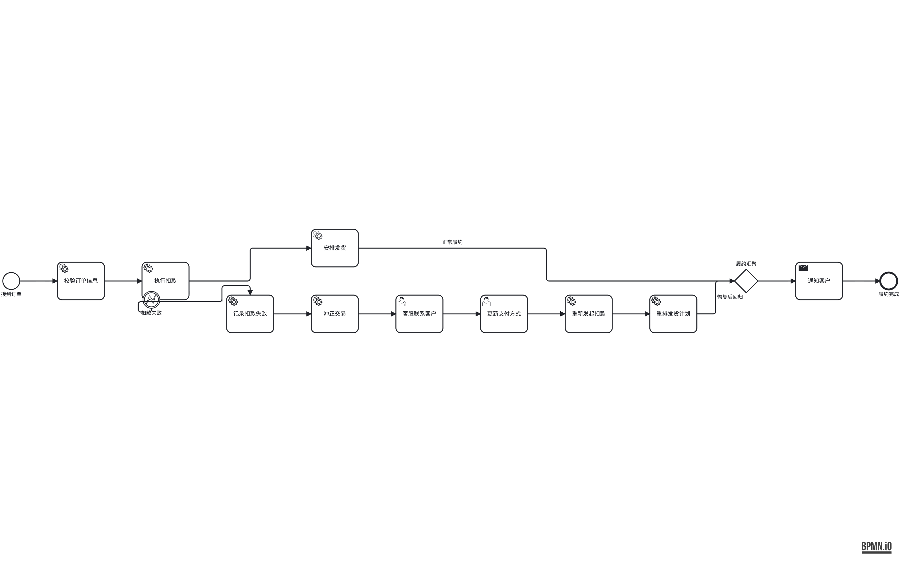
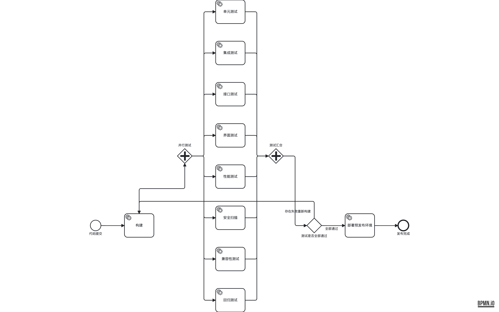

# 布局美观度诊断（2026-09-19）

> 本文是现状诊断与方案决策的**结论摘要**；逐张可执行的任务卡见
> [`aesthetics-roadmap-2026-09-19.md`](./aesthetics-roadmap-2026-09-19.md)。
> 依据：`check:layout` 全量 98 fixture + 16 张代表性 PNG + elk-placement /
> lane-constrainer / edge-router / pipeline 结构走读。

## 一、方案没错，卡在三处结构性执行

数据：老 fixture 01–45 硬标准全 0；56 个新压力 fixture 只有 8 个脏，全聚在
4 个 bug 族（详见 `fixture-stress-findings-2026-06-12.md`）；软指标 24/98
不达标。即 **"画得对"已解决，"画得好看"停滞**。

"ELK 摆节点 + 自研 stage 做 BPMN 决策"的大方向是对的——v1 JVM hook、
v2.0/2.1 纯模板都已证伪，不回头。美观上不去是三件事：

### 1. 分片布局后拼接

主图一次 ELK，每个 boundary handler 子图再跑 mini-ELK 然后整体平移。
片与片之间一旦有边（handler 链汇回主流、handler 节点属于某条 lane），
就出 N 形回头、节点出 lane、负坐标。典型是 80："正常履约"横穿整条
handler 链，"履约汇聚"掉到左下角。

这类问题再加多少后处理 pass 都修不干净，**根因是两半各算一套坐标**。

### 2. ELK 的结果只用了 X，Y 和边全丢掉重算

lane-constrainer 665 行重写 Y；edge-router 2200+ 行按 edgeType 套模板再
跑一串 nudge pass（`layout-lessons.md` 第 7 条已记录 pass 互相打架）。
没有全局目标（交叉数 / 拐点 / 长度），每条边只看自己。典型是 101：入
join 的边穿过测试任务那一列，`构建` 被甩到远低于 fork 网关的位置；
39/54 的驳回走廊骑着首行 task 中线跑；56/90 同源扇出 label 100% 叠放。

### 3. 尺子太钝

F1–F9 里没有边交叉数、拐点数、空白率；F1/F3 把语义上必须回头的边也算
进分母，回边 fixture 天然 fail、掩盖真问题。没有 baseline 文件，任何
"美观优化"都无法自证不退步——**便宜模型尤其需要这个**，否则它只能说
"看起来好了"。

## 二、方案：6 个 Phase

| Phase | 目标 | 难度 | 收益 |
|---|---|---|---|
| 0 尺子 | F1/F3 剔回边；新增 F10 交叉、F11 拐点、F12 骑行段、F13 空白率、F14 主干拐点；`--save-baseline` / `--compare` | 低 | 使后面能被便宜模型安全做 |
| 1 硬 bug | 清 4 个 bug 族（lane 为 boundary 预留净空、多 boundary 撑宽 host、handler 负坐标、同源 label 错开） | 低–中 | 98 fixture 硬标准归 0 |
| 2 拆 pipeline | 按 `refactor-runpipeline-phases.md` 拆 `runPipeline`，XML 逐字节不变为 oracle | 低 | P3 的前置 |
| 3 去分片 | handler 节点并入主 ELK（BE→entry 边喂 ELK 时改成 host→entry，模型顺序让 handler 落下方），删掉 mini-ELK + 平移 | 中 | **最大**：80/96/77/83 一族消失 |
| 4 主干对齐 | 抽共享 `spine.ts`；先试 ELK `priority.straightness` 一行配置；不够再加 `spine-aligner` 小 stage | 中 | F2 归 0，修 101 的"构建掉下去" |
| 5 路由升级 | 层间隙竖直轨道分配 + 行间走廊轨道，替代 channel.ts 固定偏移；每接管一类边就删对应 pass | 高 | **第二**：交叉 / 骑行 / label 叠放从源头消失 |
| 6 宽高比 | lane 内长链 snake 折行（71 的 30:1） | 中 | F4 |

执行顺序：**P0 ∥ P1 → P2 → P3 → P4 ∥ P5 → P6**。
预期收益排序：P3 > P5 > P4 > P1 > P6。

## 三、执行提醒

- 卡 1.3 / 1.5 是 P3 之前的临时修，P3 做完就删；P3 排得近可直接跳过。
- 已证伪、不要走的路：ELK partition、fork elkjs、serializer 兜底、
  按 fixture id 特判。
- **baseline 只在人看过 PNG 之后手动更新**——这是防止便宜模型"用尺子
  过 CI"的唯一门禁。
- 什么时候该回头怀疑方案：P3 做完 80/96 仍要靠 pass 修，或 P5 首版让
  F10 反而上涨且找不到原因。在那之前不必下结论。

## 四、执行进度记录

> 每张卡完成后在此追加一行：日期 / 卡号 / 结果（规则从几到几）/ commit。

- [x] P0 卡 0.1 F1/F3 剔语义回边（F1 8→1、F3 17→5；e833ab0）
- [x] P0 卡 0.2 F10–F14 新指标（F14 换行边免 2 弯；e833ab0）
- [x] P0 卡 0.3 baseline + `--compare`（bootstrap baseline 已存 docs/layout-baseline.json；e833ab0）
- [x] P1 卡 1.1 lane boundary 净空（82/99 N2/N3→0；96 BE 修好；7cdf22b）
- [x] P1 卡 1.2 多 boundary 撑宽 host（83 B1 2→0、E4 3→2；b758886）
- [x] P1 卡 1.4 同源扇出 label 错开（56/90 L3→0；8ae19aa）
- [x] ~~P1 卡 1.3 handler 负坐标~~ **跳过**（P3 同 session 完成，临时修不需要）
- [x] ~~P1 卡 1.5 handler re-snap lane~~ **跳过**（P3 后自然归位）
- [x] P2 拆 runPipeline（12 phase + runStage 权威 ICE 归属；XML 指纹逐字节不变；a9c448a）
- [x] P3 去分片（spike+合并一次完成：handler 并入主 ELK + yHint 压下方 + BE 骑边侧/label 侧跟随；**硬标准 98 fixture 归 0**；8aa6676）
- [ ] P4 主干对齐——卡 4.2（ELK straightness 一行配置）**实测后放弃**：101 全好但 04/13/14/17/21/65 明显变差，不符「04 不能变差」验收，已完整回滚。待做：卡 4.3 spine-aligner 独立 stage、4.4 扇出对称
- [ ] P5 路由升级（卡 5.0 盘点 → 5.1 竖直轨道 → 5.2 水平走廊 → 5.3 删 pass）
- [ ] P6 宽高比（lane 内长链 snake；71/49/74/76/88/93 + P3 后新增 77/80/81 的 handler 链拉宽）

### 当前状态（P3 完成时）

- **硬标准：98 fixture 全 0**（起点：24 处违例 / 8 fixture 脏）。
- 软指标：F3 剩 3 fail（06/09 线性链回退、69 pingpong——真问题）；F4 12 fail
  （含 P3 新增 77/80/81，卡 3.2 已预告归 P6）；F14 14、F13 40（新尺子照出的全库
  稀疏/主干抖动，归 P4/P6）；F12 3、F8 2（归 P5）。
- **待人审 PNG 后更新 baseline**：`bun run check:layout --save-baseline docs/layout-baseline.json`
  + 单独 commit（roadmap §0 规则 8）。重点看：80/96/23/13/83/99/56。
- compare 门显示的 32 项软指标「变差」逐项归属：F4 77/80/81（P6）、F14 81（P4）、
  F10 83（P5）、F8 13/23（P5）、F12 80（P5）、F2 99（P1 BE 净空的固有代价，0.109
  远低于 0.30 阈值）、F11/F13/F4 小幅波动（P3 架构变化的正常重排）。
