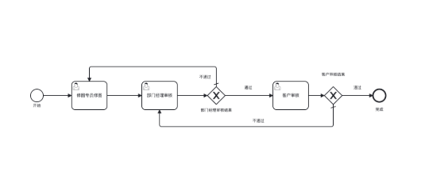
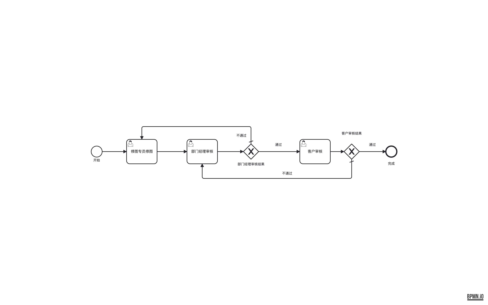
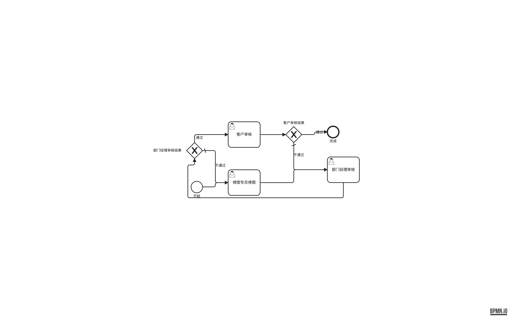
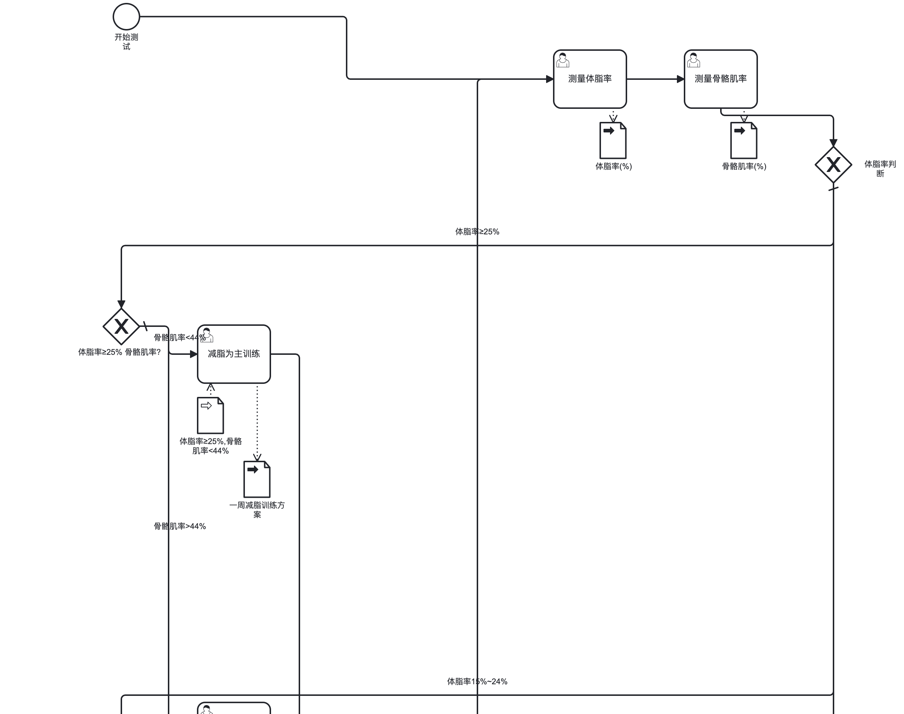

# 用户反馈分析（2026-06-11）

> 来源：桌面 `tramito测试/` 两个问题文件夹 + `tramito修改意见-流程图.docx`（6 条意见）。
> 本文是问题分析与根因定位，**尚未修复**。证据材料统一收在 `docs/feedback-2026-06-11/`。

## 结论速览

两个问题文件夹指向同一处嫌疑代码：`src/stages/elk-placement.ts` 的 **no-lane pool 配置**。

| # | 问题 | 根因 | 嫌疑点 |
|---|------|------|--------|
| 1 | 流程顺序乱（审批回头流程被排成蛇形） | ELK GREEDY cycle breaking 断错环边 | 缺自主 back-edge 预反转 |
| 2 | 流程图拉得太长（2488×7871 竖长条） | `MULTI_EDGE` wrapping 在分支扇出上误折行 + 环回边贯穿全图 | `ELK_OPTIONS_NO_LANE` 的 wrap 配置 |
| 3 | edge label 压线/压节点、分支看不清 | label 摆位无碰撞避让、放在走廊中段 | edge-router label 摆位 |
| 4 | 线条扭来扭去（小台阶 jog） | 相邻层 Y 差十几 px 不吸收对齐 | path-shaper |
| 5 | lane 标题字横着躺 | bpmn-js 默认旋转 90°，用户要竖排汉字 | 渲染层（⏸ 待定） |
| 6 | 缺 ctrl+Z / 复制快捷键 | — | 编辑器功能，非布局引擎（❌ 已拒绝，不实现） |

---

## 问题一：流程顺序需调整（回归 bug，已逐坐标复现）

### 用户想要的效果

用户期望的就是经典的"主干一条线、驳回线绕行"画法（用户提供的目标图）：

开始 → 修图专员修图 → 部门经理审核 → 审核结果 → 客户审核 → 审核结果 → 完成，
两条「不通过」回头线分别从上方/下方绕回。

### 现状

用户给的 `调整前.bpmn` / `调整后.bpmn` **流程定义完全相同**，只有 DI 坐标不同：

- `调整前.bpmn`（旧版 tramito 输出）≈ 用户期望的线性布局 ✅

  

- `调整后.bpmn` = **当前 v2.6.1 的输出**（用 `feedback-2026-06-11/approval-loop-input.json` 重建输入跑
  `layoutBpmnXml()`，输出与该文件逐坐标一致，含 `182.1666…` 这类小数）❌

  

  硬伤：`部门经理审核结果` gateway 跑到 layer 0（x=62，比开始事件还靠左），`部门经理审核`
  反而在最右，主流程视觉顺序完全打乱（F1/F3 全破），还有 label 压线。

这是**回归**：同一输入，旧版能给出正确线性布局，当前版本不能。

### 根因：ELK GREEDY cycle breaking 断错环

这种"审批-驳回"双环流程，正确断环应该 reverse 两条「不通过」回头边（`flow_12`、`flow_9`）。
用仓库 ELK 单例做的对照实验：

| 配置 | 结果 |
|------|------|
| 当前配置（GREEDY 默认） | gateway_4 进 layer 0，蛇形乱序 |
| `cycleBreaking: MODEL_ORDER` / `DEPTH_FIRST` / `GREEDY_MODEL_ORDER` | 仍然不对（或被 wrap 折行） |
| **预反转两条回头边 + wrap OFF** | **完美复现目标线性布局**（1096×146，顺序与用户期望一致） |

结论：靠 ELK 自己断环不可靠。

### 修复方向

**设计原则：尊重阅读习惯，主流程永远从左向右。** 具体拆成三层：

1. **主干 = happy path**：start → … → end 主链 X 严格单调递增，不回头（F1/F3）。
   断环本质是在决定"谁是主干、谁是回头线"，所以必须断对。
2. **回头线是绕行，不是主干**：驳回/重做 loop 边识别为 back edge，从主干上/下方绕回，
   不参与 X 排序（用户目标图即此画法）。
3. **语义优先于图论**：哪条边算回头线不能只靠图论（GREEDY 对双环结构会断错），要用
   BPMN 语义加权——default flow、标"不通过/驳回"的 gateway 出边、指向声明顺序更早
   节点的边，优先当回头边。
   例外：明确的子流向（boundary handler 子图）可向下分叉，主流程本身不例外。

实现：在 `elk-placement` 之前自主做 back-edge 检测——从 start event 沿声明顺序 DFS 标记
回头边（按上述语义加权），把回头边**预反转**后喂 ELK（喂进去的图无环，GREEDY 无从出错）。
EdgeRouter 不受影响：它按 loader 模型的真实方向路由。

另外：`check:layout` 现有 15 条硬标准没拦住这种乱序图——缺一条「X 顺序与拓扑顺序一致」的
检测（F3 backtracking 指标也没覆盖到），修复时应一并补上。

---

## 问题二：流程图拉得太长，需缩短

用户截图 `feedback-2026-06-11/too-tall-full.png` 实际尺寸 **2488×7871（约 1:3.2 竖长条）**。
内容是体测流程：3 路体脂率分支 × 每路 2~3 个骨骼肌率子分支，每个训练 task 挂 2 个
data object，结尾"一周后复测"大环回到开头。

问题链：

1. **分支 gateway 对角线向下级联**：`体脂率判断` 在右上，三个子分支 gateway 依次跑到左下方，
   每个分支簇占一整"行"（行距 700~900px，远超内容高度）。这是 `ELK_OPTIONS_NO_LANE` 里
   `MULTI_EDGE` wrapping（`aspectRatio 4.0`）折行的形态。实验确认：即使断环正确，7 节点链
   也会被 wrap 折成 904×326 两行——`elk-placement.ts` 注释"4-8 节点单行链不 wrap"的假设
   是错的（回头边会改变 wrap 判定）。
2. **wrap/环回边贯穿全图**：「继续复测」「停止训练」「体脂率<15%」几条边纵跨 7800px，
   label 孤零零挂在走廊中段——对应 docx 第 4 条"线条扭来扭去"、第 2 条"分支看不清"。
3. **label 压线/压节点**（L2/L3 违例）：「骨骼肌率<44%」压在任务框上、「体脂率≥25%
   骨骼肌率?」与 gateway label 堆叠、最左 gateway 的 label 被画布边缘截断。

### 修复方向

- 重新评估 no-lane wrapping：要么 OFF + 别的方式控宽，要么修正触发阈值并把 wrap 边路由做对。
- 分支簇行高过大：复查 artifact-placer 的纵向 reservation 与行距叠加。

---

## docx 六条意见对照

| # | 意见 | 决策 | 归属 / 动作 |
|---|------|------|------------|
| 1 | ctrl+Z / 复制快捷键 | ❌ 拒绝 | 编辑器功能（`serve-editor`），非布局引擎职责，不实现 |
| 2 | 分支"通过/驳回"要一眼看清（正面示例：label 紧贴 gateway 出口） | ✅ 做 | edge label 应贴近 gateway 出口，而非走廊中段 |
| 3 | 字不要被线条挡住（反面示例：「审批结果」被线压住） | ✅ 做 | L2 违例；edge label 摆位需与既有线路做碰撞检测 |
| 4 | 线条走直线、不要扭来扭去 | ✅ 做 | ① wrap 边绕行（问题二）② 相邻层 Y 差 ~13px 的小台阶 jog（如本例 `flow_8` 的 235.5→222.17）应吸收对齐 |
| 5 | lane 标题字可竖排、不能横着躺 | ⏸ 待定 | bpmn-js 把 lane label 旋转 90°；需渲染层支持竖排汉字，成本/收益待评估 |
| 6 | 线条精简化（正面参考图：多 lane 审批流） | ✅ 做 | 同 2/4 的综合诉求，可作为验收参考图 |

---

## 下一步（按 `docs/layout-fix-workflow.md`）

1. 把两个用户案例落成 fixture：
   - 审批双环流程（输入已重建：`feedback-2026-06-11/approval-loop-input.json`）
   - 体测分支流程（需向用户要原始 ELK-BPMN JSON，目前只有 PNG）
2. 修 cycle breaking（自主 back-edge 预反转）→ 验收目标 = 本文「用户期望的线性布局」图。
3. 重新评估 no-lane wrap 策略。
4. `check:layout` 补「X 顺序与拓扑顺序一致」检测。
5. edge label 碰撞 / 小台阶 jog，分项处理（lane label 竖排待定，快捷键已拒绝）。
